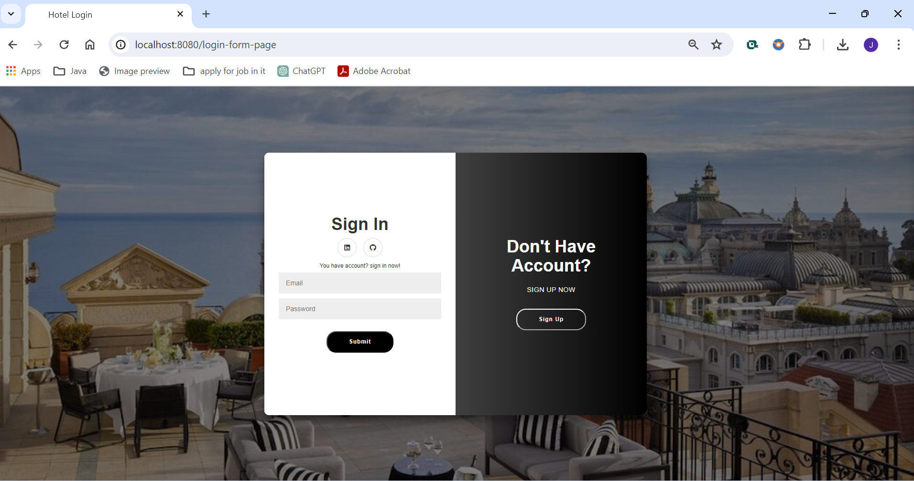

# Hotel Room Booking Management System

## Overview

This project is a Hotel Room Booking Management System developed using the Spring Framework in Java. It provides a web-based interface for managing hotel room reservations. The backend is implemented using Spring Boot with Thymeleaf as the template engine for the frontend. Spring Security is utilized for handling authentication and authorization. Java Persistence API (JPA) with the entity manager is employed to manage the MySQL database connection.

## Features

User Sign Up and Login: Users can create a new account and log in securely.
Reservation Management: Each user can perform CRUD (Create, Read, Update, Delete) operations on reservation forms.
Responsive Design: The frontend is designed to be user-friendly and responsive across various devices.

### Technologies Used

- Java
- Spring Framework
- Spring Boot
- Thymeleaf
- Spring Security
- Java Persistence API (JPA)
- MySQL
- Maven

## UML Digram

## Database Design Architecture

Project Interface Test

## Sign In:

You can’t open any another page without sign in, you will directly transfer automatic to this page.

## Sign Up

Here you can Sign Up new account of your own and will be saved next time you can just sign in directly.

## Home:

There are many sections about the hotel to view it and information about it, Rooms, Services, Review. Etc It’s a full page with header and content and footer. You can use features like, Log Out, New Reservation or view logged in user reservations.

## New Reservation:

Reservations page, here you can book a room.

## Reservations List:

In this page you can modify your reservation and see list of user logged in reservations and can delete it or can update it with another choices.

